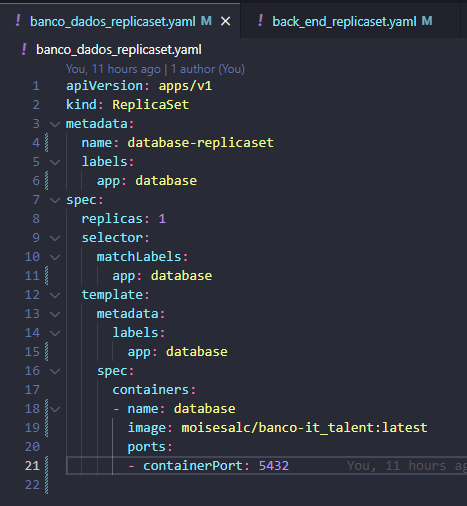
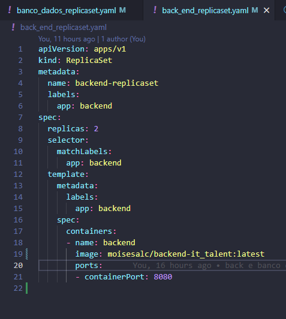
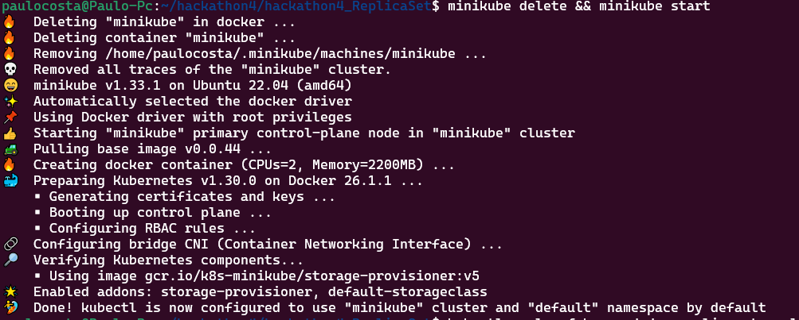
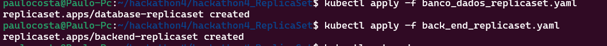
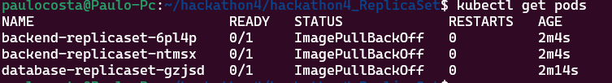
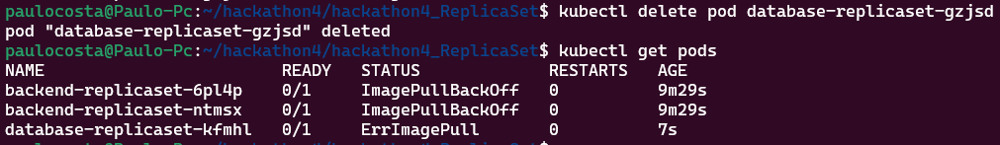

# 4º HACKATHON It Talent

Kubernetes ReplicaSet Setup

Este repositório contém os arquivos necessários para criar e gerenciar um ReplicaSet no Kubernetes com uma instância do banco de dados e duas instâncias do backend.

## Pré-requisitos

- Kubernetes instalado e configurado.
- Acesso ao `kubectl`.
- Docker instalado e configurado.
- Conta no Docker Hub.
  
## Estrutura do Repositório

- `banco_dados_replicaset.yaml`: Arquivo de configuração do ReplicaSet do banco.
  
- `back_end_replicaset.yaml`: Arquivo de configuração do ReplicaSet do back.
  
- `SubindoKubernetes.png`: Subindo o ambiente desenvolvimento com o minikube.
   
    ```sh
   minikube delete && minikube start 
- `instanciasdoBackeBanco.png`: Prints mostrando a execução dos ReplicaSets.
  
  ```sh
    kubectl apply -f banco_dados_replicaset.yaml
    kubectl apply -f back_end_replicaset.yaml 
- `print-exclusao.png`: Print mostrando a inicializações dos pods.
  
  ```sh
   kubectl get pods
- `DeletePodBanco.png`: Print mostrando a exclusão e  normalização automática doReplicaSet.
  
  ```sh
  kubectl delete pod database-replicaset-gzjsd 
